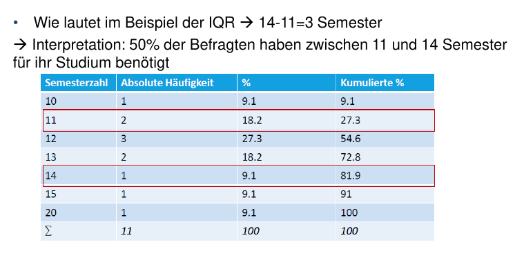

#Statistik #Empisoz #Tutorium 
# Erklärung IQR
***

Definition: Differenz zwischen dem oberen Quartil und dem unteren
Quartil

Berechnung: IQR = Q_0.75 - Q_0.25

***

Berücksichtigt mittlere 50% der Verteilung, weniger anfällig ggü.
Extremwerten

vor allem sinnvoll, wenn der Kernbereich einer Häufigkeitsverteilung -
d.h. wenn die zentral gelegenen 50% der Merkmalsausprägungen –
interessieren

Je größer der IQR desto stärker streuen die Beobachtungen

# Übung

***

Beispiel: 

⇒ Es müssen die Quartile d. Verteilung bestimmt werden ⇒ Häufigkeitstabelle benötigt!

***

Aufgabe: 

1. Erstellt eine Häufigkeitstabelle aus der folgenden Urliste

2. berechnet Prozente und kumulierte Prozente

3. markiert die Quartile

4. berechnet und interpretiert den IQR

***

1 = gut | 2 = eher gut | 3 = eher schlecht | 4 schlecht

| ID | Wie gefällt dir das Tutorium? 
|----|-----------------------------------------------------------------|
| 1  | 1                                                               |
| 2  | 2                                                               |
| 3  | 1                                                               |
| 4  | 3                                                               |
| 5  | 2                                                               |
| 6  | 1                                                               |
| 7  | 3                                                               |
| 8  | 4                                                               |
| 9  | 2                                                               |
| 10 | 1                                                              |

***

### Lösung:

| Antwort           | Absolute Häufigkeit | %   | kumul. % | Quartil | IQR      |
|-------------------|---------------------|-----|----------|---------|----------|
| 1 (gut)           | 4                   | 40% | 40%      | 1       |          |
| 2 (eher gut)      | 3                   | 30% | 70%      | 2       |          |
| 3 (eher schlecht) | 2                   | 20% | 90%      | 3       | bis hier |
| 4 (schlecht)      | 1                   | 10% | 100%     | 4       |          |
IQR = 3 - 1 = 1 
**Interpretation:** Die mittleren 50% der Befragten finden das Tutorium mit einem IQR von 2 bei 4 möglichen Antworten gut bis eher schlecht.

