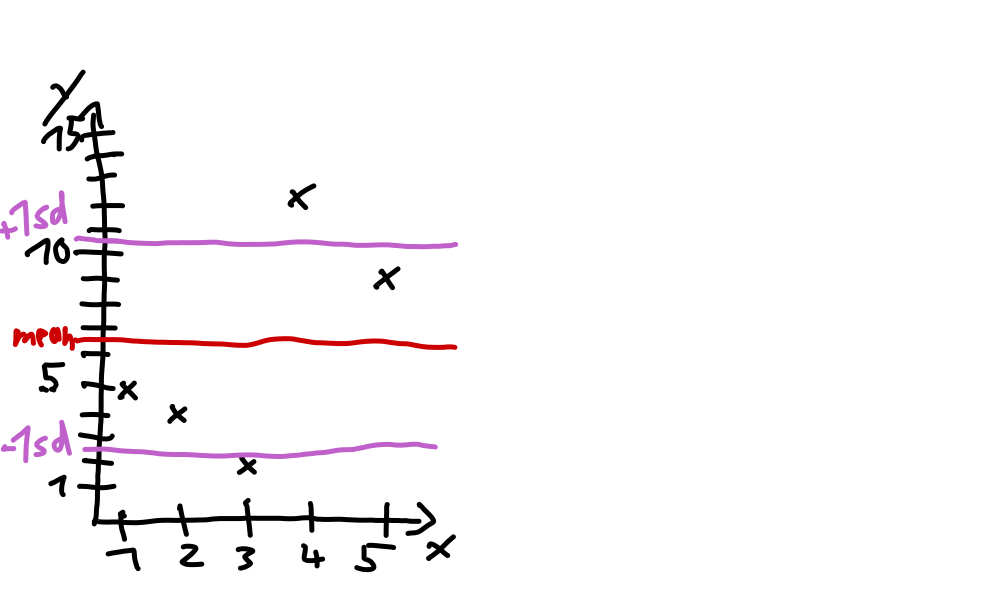
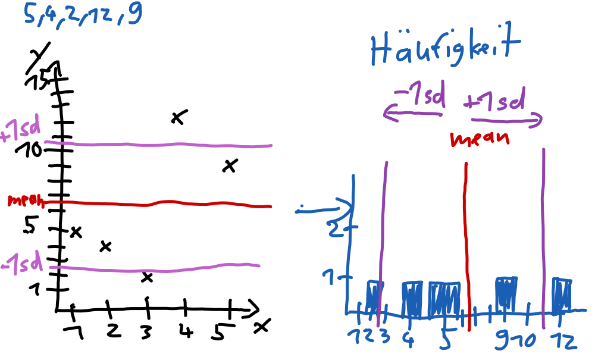
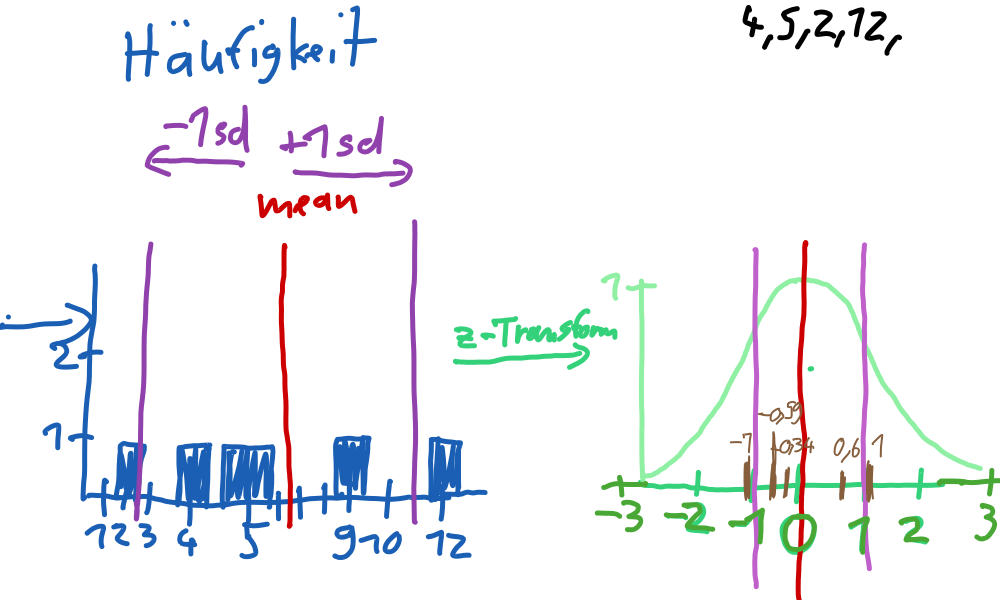
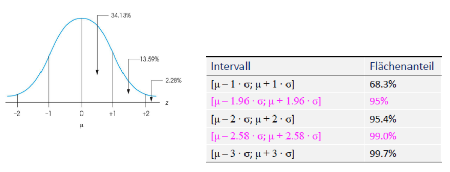

```{r setup, include=FALSE}
knitr::opts_chunk$set(echo = FALSE)
```

# Kurze Wiederholung der Vorlesung


--- 
 
| Stichprobe | Wahrscheinlichkeitsverteilung |Grundgesamtheit |
| :-------   | :------- | :------- |
| Kennwertwerte   | Parameter | Parameter|
| Mittelwert $\bar{x}$ | Erwartungswert $\mu$ | Mittelwert $\mu$ |
| Standardabweichung $s$ | Standardabweichung $\sigma$ | Standardabweichung $\sigma$ |
| Varianz $s^2$ | Varianz $\sigma^2$ | Varianz $\sigma^2$ |


## Wahrscheinlichkeit
 
**Wahrscheinlichkeit:** Maß für Chance, dass ein bestimmtes Ereignis eintritt
 
>  $$P(A) = \frac{\textrm{positive outcomes}}{\textrm{alle möglichen Ergebnisse}}$$

 > - Wahrscheinlichkeit = _"relative Häufigkeit eines Ereignis"_
 
 > - empirische Wahrscheinlichkeit = Schätzwert für Wahrscheinlichkeit

 
## Standardnormalverteilung

 > **Definition:** 

 > (1) $\mu = 0$
 > (2) $\sigma = 1$

 > - _**Was passiert genau?**_
 
---

## Z-Werte

 > - Was sagt der Z-Wert eines Rohwertes aus und wie wird er berechnet?
 
 > - $z_i = \frac{x_i-\bar{x}}{s}$
 > - Der Rohwert wird nichtmehr als absolutes Ergebnis (_"Lara hat Note 2 erreicht"_) sondern relativ zum Rest der Verteilung angegeben (_"Lara hat eine Note erreicht, die 2 Standardabweichungen über dem Durchschnitt der Klasse liegt"_)
 > - _**Z-Transformation:**_
 Z Werte für alle Rohwerte einer Verteilung berechnen


## Übung 
 berechnet die Z-Werte für folgende Roh-Werte (Es handelt sich um Punkte einer Klausur) und plottet  
 5,7,2,12,8
```{r, echo=TRUE}
Werte <- c(5,4,2,12,9) 
# Mittelwert
mean(Werte)
# standard deviation
sd(Werte)
```

$z_i = \frac{x_i-\bar{x}}{s}$
 


## Lösung
```{r, echo=TRUE}
Werte <- c(5,4,2,12,9) 
scale(Werte)
```

## Z-Transformation anschaulich gemacht



--- 



--- 
Das Beispiel besteht natürlich aus zu wenigen Werten, aber wenn man viele Werte einer Normalverteilten Variablen nimmt sie die typische Glockenförmige Verteilung an. 

- Wenn wir mehr Klausurteilnehmer hätten würde die Kurve vermutlich Glockenförmig aussehen,



## Mit der Standardnormalverteilung arbeiten

Was bringt uns diese Transformation?
[Selbstlernmodul - Zentrales Grenzwerttheorem](https://lehre.bpkleer.de/stats101/LM3/chapter4/page-4-b/)
-Wenn man irgendeine Variable aus der Bevölkerung unendlich oft misst, die unabhängig und identisch Verteilt ist und diese Z-Transformiert erhalten man **IMMER** eine Standardnormalverteilung. 

- vorhin haben wir gesehen, dass die Standardnormalverteilung eine angepasste Häufigkeitsverteilung ist
 > - Die Fläche unter der Dichtefunktion beschreibt die Wahrscheinlichkeit, dass der jeweilige Wert auftritt, denn der Wert ist ja auch sooft in der Grundgesamtheit insgesamt verteilt... 


- Normalverteilung: $\mathcal{N}(\mu,\,\sigma^{2})$
- Standardnormalverteilung: $\mathcal{N}(0,\,1)$

## Aufgabe
 N = 50.000 Personen mit Körpergröße $\mathcal{N}(175,5)$
 Wie groß sind 95% aller Personen?


## Lösung

 - 175-1,96 = 165,2
 - 175+1,96 = 184,5
 - 95% aller Personen sind zwischen 165 und 184cm groß


## Tolle Videos zum üben

Das Video, welches wir im Tutorium geschaut hatten: https://youtu.be/uwhV0TAPmWc

hier noch ein kurzes Video um das Verständnis zu schärfen: https://www.youtube.com/watch?v=2fzYE-Emar0

