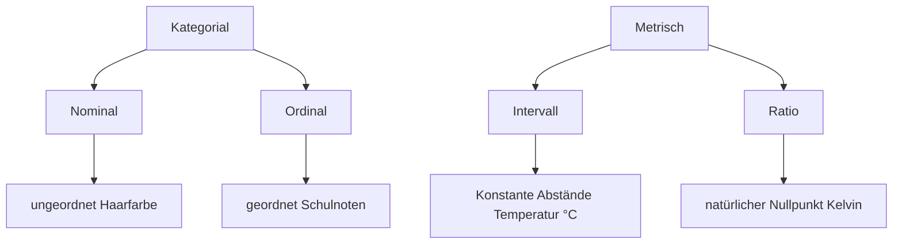

# VL 1 - Grundlegende Begriffe

## Was ist Statistik

- Deskriptiv
    - Merkmale 
    - Zusammenhänge  
    - Grafische Datstellung 
    - Lage und Streumaße 
- Inferenz
    - GG/Stichprobe
    - Stichprobenfehler
- amtliche Statistik
    - von Institutionen in Auftrag gegeben
- Explorative Statistik
  - Zusammenhänge in Daten finden
  - Big Data

## Grundbegriffe

- Grundgesamtheit
  - Menge der Objekte für die die Aussage der Untersuchung gelten soll
- Stichprobe
  - systematische Auswahl einer Teilmenge von Elementen aus der GG
- Stichprobenfehler
  - Merkmalsausprägung in GG und Stichprobe unterscheidet sich

## Skalenniveaus

# VL2 - Univariate Statistik

